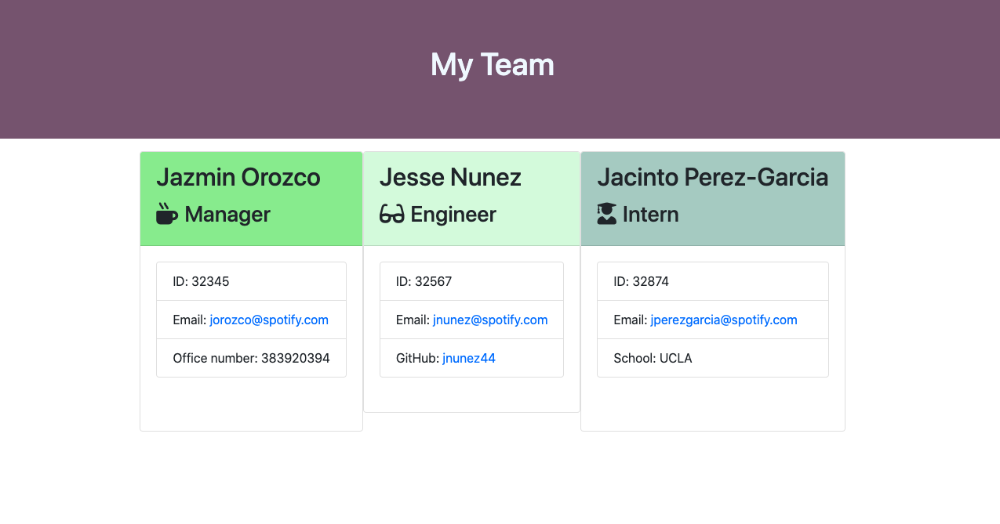

# Team Engine Generator

This is a CLI application that allows a given manager to generate an HTML file with current information of all his/her/their employees. When the manager starts the application, he/she/they are prompted with a series of questions that asks about the manager's information. Once done, the manager is able to add any other employee who is either and engineer or intern. 

This is the video demonstrating the application's functionality: 
<iframe src="https://drive.google.com/file/d/1dFWXb1aKkdODhYUlHTdA6CaRbQuaYvbc/preview" width="640" height="480"></iframe>

## Project Status
At the time of this README, this application is fully functional. This will be an ongoing project, however, as the final product displays all cards together. I will work on making it more spaced out and evenly distributed. 

## Installation
In order to use this application, the manager would need to download this application system onto his/her/their local machine. Then, the manager would use `terminal` if on a MAC or `command line` if on a Windows. Since this application has inquirer questions, the manager would also need to input `npm install inquirer`. 

## Usage
When the manager finishes the installation process, he/she/they are prompted with a set of basic contact information. After, the manager is able to include information from other employees - each time, the CLI application asking the manager if the next employee is an engineer or an intern. Should the manager finish using the application, the manager is able to click `no` after the question `Do you want to add another employee`? 

The end product should be an `html` page with cards displaying each employee's contact information, and it should look somewhat similar to this:

## Contributing
Pull requests are welcome. For major changes, please open an issue first to discuss what you would like to change.

Please make sure to update tests as appropriate.

## Support
Should you have any questions or concerns about my application, feel free to reach out to me at garciamaira524@yahoo.com